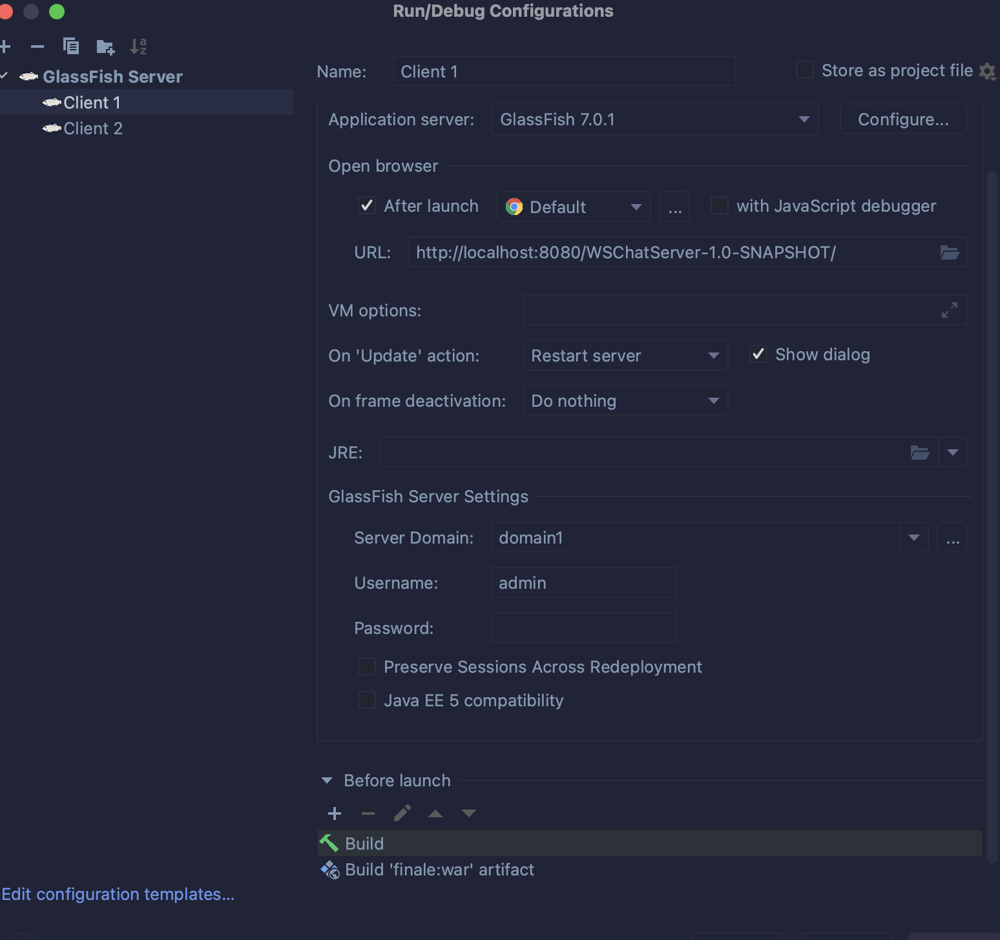

# CHAT SERVER 
> Course: CSCI 2020U: Software Systems Development and Integration

The following application is a multi room multi client chat server

## Overview
* We coded our own web chat server using Java web application.
* The chat server that we created, uses websockets and HTML/Javascript/CSS.
* Our web chat server has multiple chat rooms, allowing messages to be sent throught the same room.
* When joining a different room, the user will automatically leave the other server room they were in.
* Lastly the user needs to be in a room for them to be able to send messages.
## HOW TO USE APPLICATION
**Connect to the websocket**
* 1st. git clone the repository
* 2nd. once you have configured and let the IDE install maven and all the necessary requirements
* 3rd. create a new local configuration of glassfish with the following configuration shown in [configuration.png]
* 

## Chat interaction and functionalities

The user must either establish or join an existing chat room in order to use the online application. The server will choose a random alphanumeric code when making a new room.
The user will be prompted to enter a username when entering a new room. The new user will be welcomed by the chat server. The server will also let individuals who were already in the room know that a new user has joined.
You will print the timestamp next to each chat message.When the user presses the enter key, the messages are sent.A "send" button is an optional addition.
On the UI, a list of the currently active chat rooms should be visible. To update the list, add a "refresh" button. Keep in mind that you must include a "about" page where you can publish details about the web application, like group members.

**GET a new (unique) room code**
* Once you have clicked on create a new room you will be given a unique room code which will be kept in the list of available rooms which you can keep track off.

## Happy Chatting! 
- Roman Ahmad Zeia, Kevin Waran

